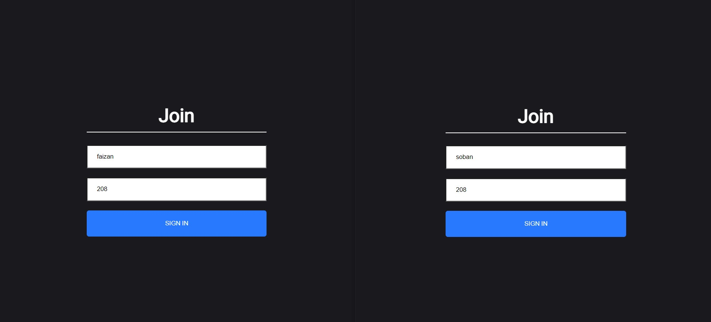
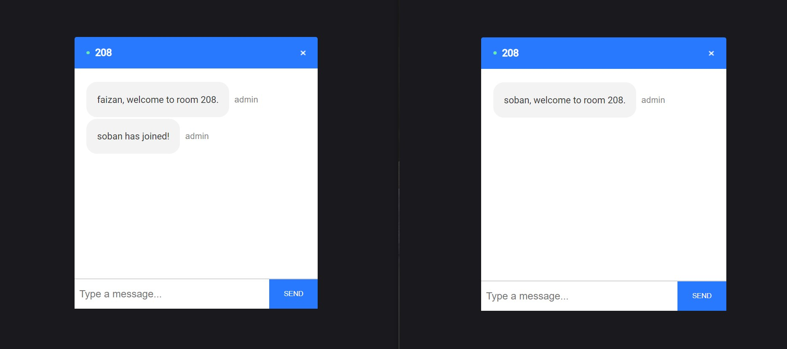
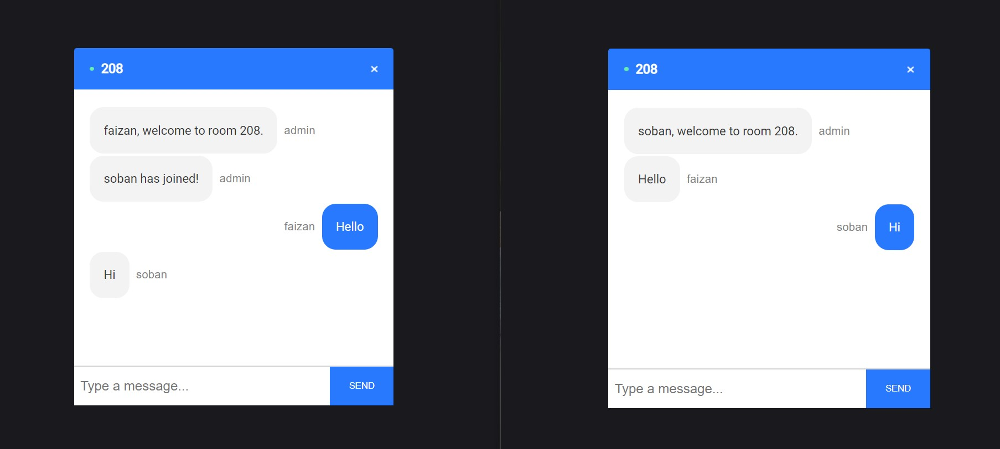
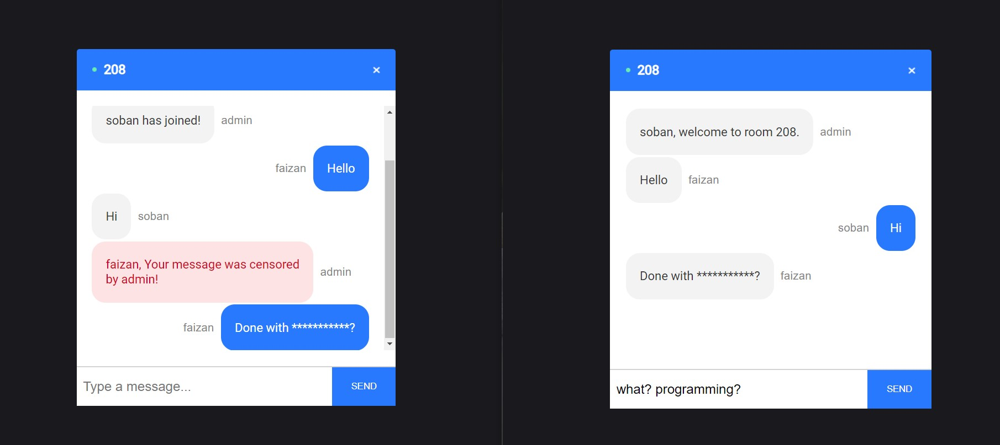
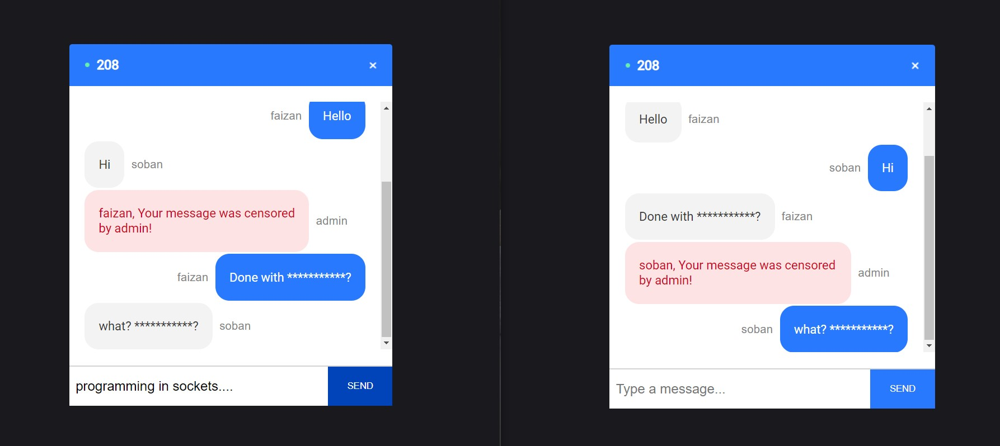

## A chat application built using ```Socket.io``` and ```React```

### This application helps users to connect and join to a chat room bind to a chat server where they can send and receive messages. The server has the capability to **block** certain words sent by users and censor them accordingly.

<br>

The application is live on **https://sf-reactjs-chat-app-socketio.netlify.app**

<br>

To run this application in your local environment
1. Clone the repo using `git clone` on your local machine.
2. Run `npm i` in both the folders _server_ and _client_ by using `cd` command.
3. Spin up the server in the _server_ folder in one terminal using `nodemon index.js` or `npm start`.
4. In another terminal, `cd` over to the _client_ folder and run `npm start`. This will launch the application in the **localhost** of your browser.

<br>

Some screenshots of the application:



<br>


<br>


<br>


<br>

